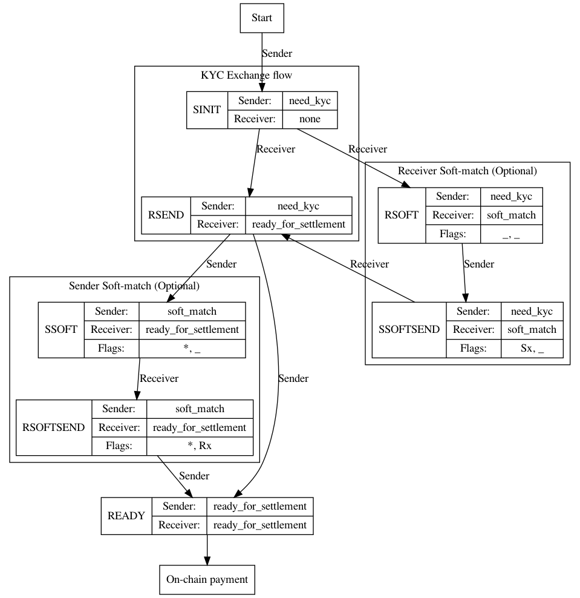
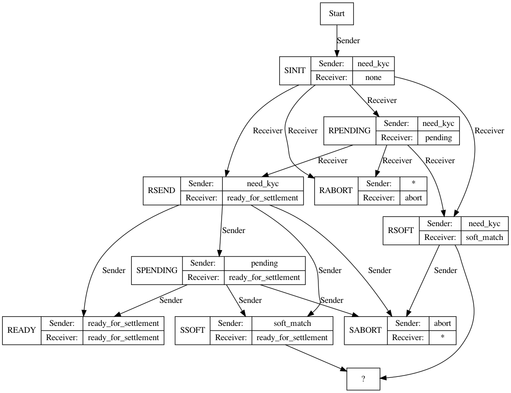

# A simplified state machine for the LIP-1 off-chain `PaymentObject`/`PaymentCommand` protocol

## What is the problem?

Currently the off-chain protocol specified in LIP-1 allows payment objects to be a large variety of states, that could be updated concurrently by both Sender and Receiver VASPs. The large number of states and possible commands in response to these states makes compatible implementations difficult to implement, test and ensure they are conformant and interoperable.

## Outline of solution

We propose a simplified protocol in terms of the number of possible states as well as the number of transitions between these states. At each state it is easy to determine which VASP should submit the next command, and what information to include.

## Detailed solution

The protocol and data structures of LIP-1 are used.

As a reminder: two VASPs participate in the off-chain protocol. They each can define a `PaymentCommand` that create or update a single `PaymentObject`. Each `PaymentCommand` is sent to the other VASP in a `CommandRequestObject` and responded to by a `CommandResponseObject`. A `success` status in the response indicates that the object is updated by both VASPs (a command `failure` indicates the command is invalid, and a protocol failure indicates the command should be resubmitted at a later time).

The state machine of the protocol is described in the figure below. An implicit abort state for the sender is available (SABORT) when the sender is expected to provide a command; similarly an implicit receiver abort state (RABORT) can be reached when the receiver is expected to provide a command. The full state transition diagram, including abort states, is available in the appendix.

A state is determined by the tuple of the status of the Sender and Receiver Actors of the latest Payment Object, and two flags `Sx` and `Rx`. The exact fields in the payment object for Sender and Receiver actor status are `sender`->`status`->`status` and `receiver`->`status`->`status`. The flag `Sx` and `Rx` are set when the Sender or the Receiver has included `additional_kyc_data` in the actor field (`Sender`-> `kyc_data` -> `additional_kyc_data` and `Receiver`-> `kyc_data` -> `additional_kyc_data` respectively).

The states (Sender Status, Receiver Status, Sx Flag, Rx Flag) are:

Basic KYC exchange flow

* SINIT: (`need_kyc_data`, `none`, `*`, `*`)
* RSEND: (`need_kyc_data`, `ready_for_settlement`, `*`, `*`)
* RABORT1: (`need_kyc_data`, `abort`)
* SABORT: (`abort`, `ready_for_settlement`, `*`, `*`)
* READY: (`ready_for_settlement`, `ready_for_settlement`, `*`, `*`)

Soft-match disambiguation states:

* RSOFT (`need_kyc`, `soft_match`, `_`, `_`)
* SSOFTSEND (`need_kyc`, `soft_match`, `Sx`, `_`)
* SSOFT (`soft_match`, `ready_for_settlement`, `*`, `_`)
* RSOFTSEND (`soft_match`, `ready_for_settlement`, `*`, `Rx`)

A star (`*`) denotes _any_ value, while an underscore (`_`) for a flag denotes _not set_.

The sender and receiver of the payment take turns issuing `PaymentCommand` Objects, until the object they create or mutate is in one of the final states, namely SABORT, RABORT1 or READY. In the diagram below the Sender or Receiver labels on state transition arcs indicate the originator of the command that triggers the transition. Some abort codes may allow a new payment to follow from an aborted payment.

## Steps of the protocol: The KYC Exchange Flow

The basic KYC exchange flow starts with the Sender including KYC information and requesting KYC information by the receiver. In the straight-forward case the Receiver is satisfied with this information and responds with a command providing the receiver KYC information, and recipient signature. The Sender can then finalize the payment and also settle it on-chain (status sequence SINIT -> RSEND -> READY). At each step Sender or Receiver may also abort the payment.

### Start -> SINIT
The Sender issues `PaymentCommand` to create initial payment.

The sender creates a payment object, that they believe requires KYC information exchange. The payment command includes a full payment object including all mandatory fields and the following optional fields populated as:

* `Sender` -> `Status` -> `Status` = `need_kyc_data`.
* `Sender` -> `kyc_data` = The `KycDataObject` representing the sender.
* `Receiver` -> `Status` -> `Status` = `none`

### SINIT -> RSEND
The Receiver issues `PaymentCommand` to update an existing payment.

The receiver VASP examines the `Sender` -> `kyc_data` object, and is satisfied that given the sender information the payment can proceed. It responds with a Payment Command that includes:

* `Receiver` -> `Status` -> `Status` = `ready_for_settlement`
* `Receiver` -> `kyc_data` = The `KycDataObject` representing the receiver.
* `recipient_signature` = a valid recipient signature.

### SINIT -> RABORT1
The Receiver issues `PaymentCommand` to update an existing payment.

The receiver VASP examines the sender KYC information and is either not satisfied the payment can proceed, needs more time to process the KYC information, or requires additional information to determine if the payment can proceed. It includes a command to abort the payment with an appropriate error code.

* `Receiver` -> `Status` -> `Status`: `abort`
* `Receiver` -> `Status` -> `abort_code`: one of `no-kyc-needed` or `rejected`.

The sender can initiate a payment on-chain in case of an abort with `no-kyc-needed`.

### RSEND -> READY

The Sender issues `PaymentCommand` to update an existing payment.

The Sender VASP examines the KYC information from the Receiver and is satisfied the payment can proceed.

* `Sender` -> `Status` -> `Status`: `ready_for_settlement`

The payment can be executed on-chain by the sender (or settled in any other way).

### RSEND -> SABORT

The Sender issues `PaymentCommand` to update an existing payment.

The sender VASP requires more time, has a soft match for the receiver or cannot proceed with the payment. It issues an abort command:

* `Sender` -> `Status` -> `Status`: `abort`
* `Sender` -> `Status` -> `abort_code`: one of `pending`, `soft-match`, or `rejected`.

## Steps of the protocol: The soft-match states and flows

### Receiver soft-match (SINIT -> RSOFT -> SSOFTSEND)

After the Sender initiates a payment by providing KYC information (SINIT), the Receiver may determine they require more information to disambiguate a match. In that case they commit a command to set `Receiver` -> `Status` -> `Status` to `soft-match` (state RSOFT) or abort. The sender may respond with a command that populates the `Sender` -> `kyc_data` -> `additional_kyc_data`, which sets the flag `Sx` (state SSOFTSEND) or abort (SABORT). Finally, if the Receiever is satisfied with the additional information they move to provide all information necessary to go to RSEND (See above, this includes receiver KYC information and recipient signature). Otherwise, the receiver can abort to state RABORT.

### Sender soft-match (RSEND -> SSOFT -> RSOFTSEND)

Similarly to the flow above, the Sender at state (RSEND) may decide they need for information about the receiver of the payment to disambiguate a soft-match. They set their status `Sender` -> `Status` -> `Status` to `soft-match` (state SSOFT). The receiver can abort (RABORT) or provide the additional KYC in `Receiever` -> `kyc_data` -> `additional_kyc` (state RSOFTSEND). The sender may then abort (SABORT) or move to READY, and settle the payment.

## Abort codes and `original_payment_reference_id`

An abort can lead to the submission of a new payment that tries to make progress past the reasons for abort. The new payment must include a reference to the previous payment.

The meaning of abort codes in the `Status` -> `abort_code` field of an `PaymentActorObject` are:

* `no-kyc-needed`: the recipient indicates that they are not willing to provide KYC information since they judge that it is not necessary. The payment can be directly executed on chain.
* `rejected`: the payment is rejected. It should not be used in the `original_payment_reference_id` field of a new payment.

## Reference specification for JWS signatures used

TODO

## Reference specification for valid `recipient_signature` fields

TODO

## Appendix A: Full state machine including abort states

