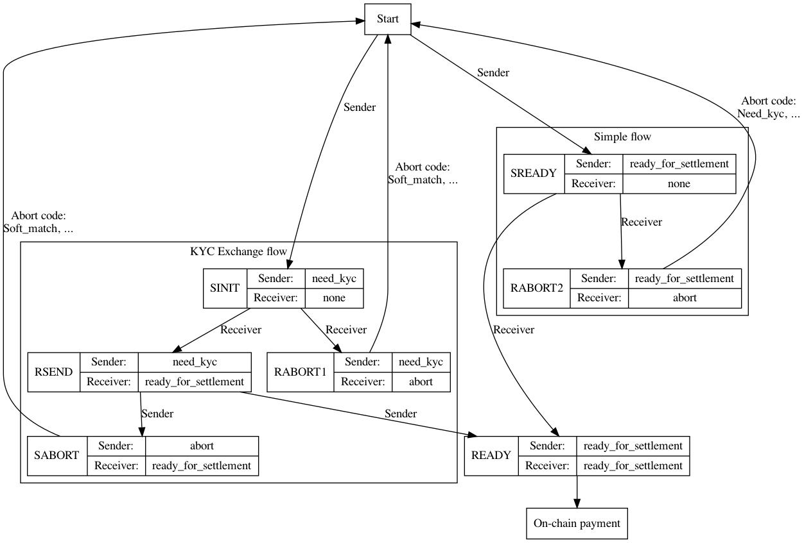

# A simplified state-machine for the LIP-1 off-chain `PaymentObject`/`PaymentCommand` protocol

## What is the problem?

Currently the off-chain protocol specified in LIP-1 allows payment objects to be a large variety of states, that could be updated concurrently by both Sender and Receiver VASPs. The large number of states and possible commands in response to these states makes compatible implementations difficult to implement, test and ensure they are conformant and interoperable.

## Outline of solution

We propose a simplified protocol in terms of the number of possible states as well as the number of transitions between these states. At each state it is easy to determine which VASP should submit the next command, and what information to include. Exception flows (pending review, soft-match and requiring full KYC exchange) are handled by aborting a payment and creating a new payment referencing it in the `original_payment_reference_id` field. Therefore all flows required by the product are supported while the technical protocol is simpler.

## Detailed solution

The protocol and data structures of LIP-1 are used.

As a reminder: two VASPs participate in the off-chain protocol. They each can define a `PaymentCommand` that create or update a single `PaymentObject`. Each `PaymentCommand` is sent to the other VASP in a `CommandRequestObject` and responded to by a `CommandResponseObject`. A `success` status in the response indicates that the object is updated by both VASPs (a command `failure` indicates the command is invalid, and a protocol failure indicates the command should be resubmitted at a later time).

The state machine of the protocol is described in the figure below. A state is determined by the tuple of the status of the Sender and Receiver Actors of the latest payment object (The exact fields in the payment object are `sender`->`status`->`status` and `receiver`->`status`->`status`). The states are:

KYC exchange flow

* SINIT: (`need_kyc_data`, `none`)
* RSEND: (`need_kyc_data`, `ready_for_settlement`)
* RABORT1: (`need_kyc_data`, `abort`)
* SABORT: (`abort`, `ready_for_settlement`)
* READY: (`ready_for_settlement`, `ready_for_settlement`)

Simple flow
* SREADY: (`ready_for_settlement`, `none`)
* RABORT2: (`ready_for_settlement`, `abort`)
* (READY as above)

The sender and receiver of the payment take turns issuing `PaymentCommand` Objects, until the object they create or mutate is in one of the final states, namely SABORT, RABORT1, RABORT2 or READY. In the diagram below the Sender or Receiver labels on state transition arcs indicate the originator of the command that triggers the transition.

## Steps of the protocol: The KYC Exchange Flow

### Start -> SINIT
The Sender issues `PaymentCommand` to crate initial payment.

The sender creates a payment object, that they believe requires KYC information exchange. The payment command includes a full payment object including all mandatory fields and the following optional fields populated as:

* `Sender` -> `Status` -> `Status` = `need_kyc_data`.
* `Sender` -> `kyc_data` = The `KycDataObject` representing the sender.
* `Receiver` -> `Status` -> `Status` = `none`
* (Optionally) `original_payment_reference_id` = The reference id of a previously aborted payment payment.
* (Optionally) `Sender` -> `kyc_data` -> `additional_kyc_data` =  If the payment `original_payment_reference_id` includes a payment that failed due to a soft match, this fields is populated to contain additional KYC data to disambiguate the match.

### SINIT -> RSEND
The Receiver issues `PaymentCommand` to update an existing payment.

The receiver VASP examines the `Sender` -> `kyc_data` object, and is satisfied that given the sender information the payment can proceed. It responds with a Payment Command that includes:

* `Receiver` -> `Status` -> `Status` = `ready_for_settlement`
* `Receiver` -> `kyc_data` = The `KycDataObject` representing the receiver.
* `recipient_signature` = a valid recipient signature.
* (Optionally) `Receiver` -> `kyc_data` -> `additional_kyc_data`: additional KYC information is included in case this payment follows one that failed with a `soft-match` abort code.

### SINIT -> RABORT1
The Receiver issues `PaymentCommand` to update an existing payment.

The receiver VASP examines the sender KYC information and is either not satisfied the payment can proceed, needs more time to process the KYC information, or requires additional information to determine if the payment can proceed. It includes a command to abort the payment with an appropriate error code.

* `Receiver` -> `Status` -> `Status`: `abort`
* `Receiver` -> `Status` -> `abort_code`: one of `pending`, `soft-match`, `no-kyc-needed` or `rejected`.

The sender can re-initiate a payment in cases of an abort with `pending` or `soft-match` abort codes using the KYC Exchange flow, possibly including additional KYC information. It can initiate a payment using the Simple Flow in case of an abort with `no-kyc-needed`.

### RSEND -> READY

The Sender issues `PaymentCommand` to update an existing payment.

The Sender VASP examines the KYC information from the Receiver and is satisfied the payment can proceed.

* `Sender` -> `Status` -> `Status`: `ready_for_settlement`

The payment can be executed on-chain by the sender (or settled in any other way).

### RSEND -> SABORT

The Sender issues `PaymentCommand` to update an existing payment.

The sender VASP requires more time, has a soft match for the receiver or cannot proceed with the payment. It issues an abort command:

* `Sender` -> `Status` -> `Status`: `abort`
* `Sender` -> `Status` -> `abort_code`: one of `pending`, `soft-match`, or `rejected`.

## Steps of the protocol: The Simple Flow

The simple flow is executed when the sending VASP believes there is no need for the exchange of KYC information. It does not include any sender KYC information, and indicates it is ready to settle on the first message.

### Start -> SREADY

The Sender issues `PaymentCommand` to crate initial payment.

The sender sends a payment with all mandatory fields the the following optional fields populated as:

* `Sender` -> `Status` -> `Status`: `ready_for_settlement`.
* `Receiver` -> `Status` -> `Status`: `none`
* (Optional) `original_payment_reference_id` = the `reference_id` of a previous payment that aborted with a `no-kyc-needed` error code.

### SREADY -> RABORT

The Receiver issues `PaymentCommand` to update an existing payment.

The Receiver examines the payment and determines that either more information is needed or the payment cannot proceed. They issue an abort with the appropriate code.

* `Receiver` -> `Status` -> `Status`: `abort`
* `Receiver` -> `Status` -> `abort_code`: one of `need-kyc` or `rejected`.

### SREADY -> READY

The Receiver issues `PaymentCommand` to update an existing payment.

The Receiver is satisfied that no KYC information exchange is needed and is happy to proceed with the payment. They send a command updating the fields:

* `Receiver` -> `Status` -> `Status`: `ready_for_settlement`
* `recipient_signature` = a valid recipient signature.

### READY

The sender upon observing a payment in the READY state can execute it on chain.

## Abort codes and `original_payment_reference_id`

An abort can lead to the submission of a new payment that tries to make progress past the reasons for abort. The new payment must include a reference to the previous payment.

The meaning of abort codes in the `Status` -> `abort_code` field of an `PaymentActorObject` are:

* `pending`: the payment cannot proceed at the moment but should be re-submitted in the future. The sender can resubmit after some time elapses.
* `soft-match`: the payment requires additional KYC information to disambiguate a soft match. The sender can re-submit a payment using the KYC exchange flow with this payment reference ID in the `original_payment_reference_id` and additional KYC data included.
* `need-kyc`: a payment needs the exchange of full KYC information. A new payment with this one in the `original_payment_reference_id` can be submitted using the KYC Exchange flow.
* `no-kyc-needed`: the recipient indicates that they are not willing to provide KYC information since they judge that it is not necessary. A Simple flow payment can be initiated with this payment in its `original_payment_reference_id`.
* `rejected`: the payment is rejected. It should not be used in the `original_payment_reference_id` field of a new payment.

## Reference specification for JWS signatures used

TODO

## Reference specification for valid `recipient_signature` fields

TODO
